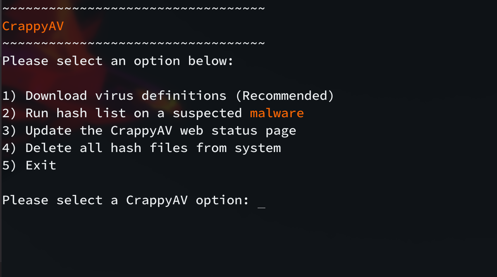
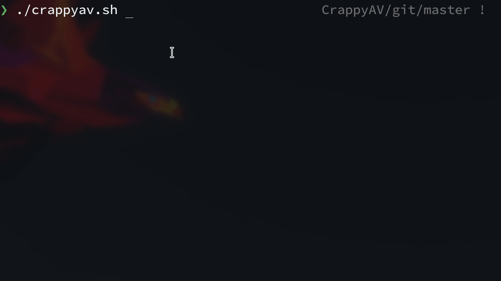
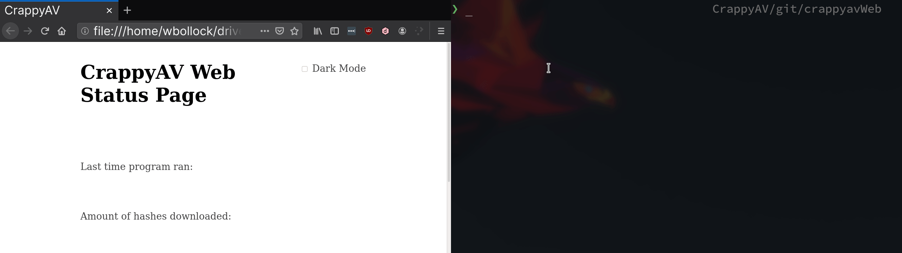

# LiteMD

A light daemon used to detect if any malware appears in a given directory - especially useful on a SFTP or web hosting server. The biggest threat is Windows malware downloaded by the user.

Fork from previous project, CrappyAv.

## Option Menu



## Quarantine Malware

Take your suspected malware and shove it in a place where the sun doesn't shine. CrappyAV will strip all permissions and put the file in virtual timeout.



## Web Status (Optional)

Show off to the world just how secure you are! 



## Usage

Run the script with:

```
./install.sh install
```

If you're using ZSH, you'll need to mapfile module.

```
zmodload zsh/mapfile
```

You'll also need `wget`.


### Testing

Proven to work with the EICAR test string only.

## Credits

Gifs made with [peek](https://github.com/phw/peek)

MD5 Hashes from [VirusShare](https://virusshare.com/hashes.4n6)

John Marks for allowing an open-ended final project one semester, and letting us continue to work on the same project in another class.
