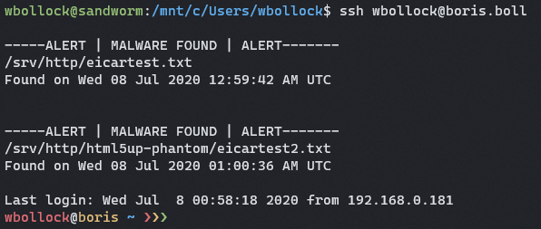

# LMD
A light shell daemon used to detect if any malware appears in a given directory - especially useful on a SFTP or web hosting server with many users. 


## Specify a Directory
LMD recurisvely calculates a hash of all files in a directory, and checks it against VirusTotal's database of MD5 malware hashes.


## Find Malware

LMD can detect malware from the calculcated hash file, and present it to the user. Below is an example of detection of the EICAR test string.


## Get Alerts on your MOTD

It's not the best method, but better than configuring SMTP. A cronjob will add alerts to /etc/motd.



## Usage


```
git clone https://github.com/wbollock/LiteMD.git
cd LiteMd
./install.sh
```

Cleanly uninstall with:

```
./install.sh -r
```

## Requirements

Arch Linux, not tested on other distros.

You'll need `wget` and `cronie`, but that's handled by the install.


## Malware Testing

Proven to work with the EICAR test string only.

## Credits

Gifs made with [ShareX](https://getsharex.com/)

MD5 Hashes from [VirusShare](https://virusshare.com/hashes.4n6)

>VirusShare.com is a repository of malware samples to provide security researchers, incident responders, forensic analysts, and the morbidly curious access to samples of live malicious code.

John Marks, for allowing awesome project development
