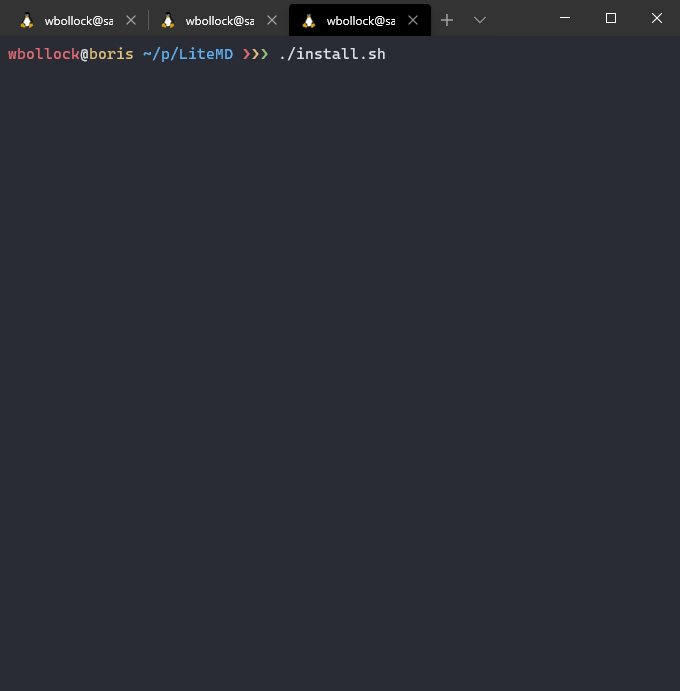
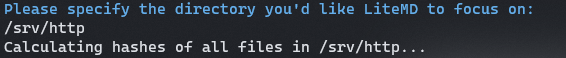
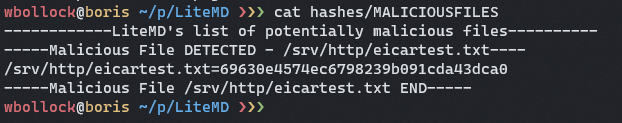

# LiteMD

A light daemon used to detect if any malware appears in a given directory - especially useful on a SFTP or web hosting server. The biggest threat is Windows malware downloaded by the user.

Fork from previous project, CrappyAV.



## Specify a Directory
LiteMD recurisvely calculates a hash of all files in a directory, and checks it against VirusTotal's database of MD5 malware hashes.




## Find Malware

LiteMD can detect malware from the calculcated hash file, and present it to the user. Below is an example of detection of the EICAR test string.



## Usage

Run the script with:

```
./install.sh
```

Cleanly uninstall with:

```
./install.sh -r
```

If you're using ZSH, you'll need to mapfile module.

```
zmodload zsh/mapfile
```

You'll also need `wget`.


### Testing

Proven to work with the EICAR test string only.

## Credits

Gifs made with [ShareX](https://getsharex.com/)

MD5 Hashes from [VirusShare](https://virusshare.com/hashes.4n6)

John Marks for allowing an open-ended final project one semester, and letting us continue to work on the same project in another class.
